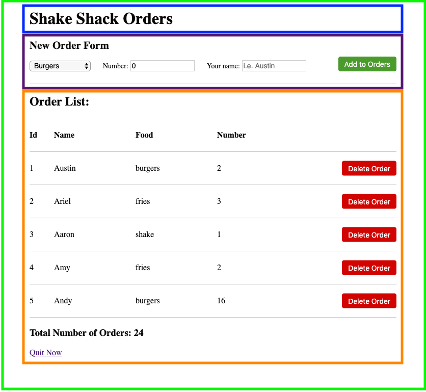

# React Parent-Children relationships

Callback to last section:
> As mentioned before, React likes to split a webpage into smaller components. You can almost think of every component like a class/object in other programming languages.

Whenever we split a component into smaller components, you can think of those smaller components as being "contained" or "wrapped" in the bigger component. We often call these parent-children relationships. In other words, a parent component (like the entire webpage or an entire header), can be split up into smaller components (like links, logo images, small text, etc.).

Let's see an example with out ShakeShack app. Here's the image of the final home page.
This entire page should be one component (light green). To make our lives easier as a developer, we should split the whole page into reasonable "sections". I could split them up in such a way that they act/look kind of independent of one another. I propose splitting it into a few sections: the title header (blue), the form (purple), and the list (orange).



Each of these sections will be their own component. These components are "children" of the home page component (who is the "parent" in this case). But, we can also go further. Each of these "children" components can be split up further (which we'll get into how later) and have "children" of their own! It's up to the developer how far they want to split things up. But the idea is to split things up so every section is easy enough to understand as a separate, isolated area.

## ShakeShack Exercise - Create children components

Go back to the `HomePage` component in `components/home/home.js`.
In the same folder, you should also see `homeOrderForm.js` and `homeOrderList.js` Go to those files and you should see the basic components for both of them (`HomeOrderForm` and `HomeOrderList`). We are going to take these components and make them children to the `HomePage` component.

Back in `home.js`, we'll have to first import `HomeOrderForm` and `HomeOrderList` using the following statements at the top of `home.js`. **Note** This is *relative pathing*. We are looking for these files which reside in the same folder.

```javascript
import { HomeOrderForm } from "./homeOrderForm.js";
```

And inject them into the `render()` return like so:

```javascript
import { HomeOrderForm } from "./homeOrderForm.js";

export default class HomePage extends React.Component {
    render() {
        return (
            <div id="view-home">
                <h1>Shake Shack Order Manager</h1>
                <HomeOrderForm/>        // <- Make sure to add it here too!
            </div>
        );
    }
}
```

Do the same for the `HomeOrderList`. It should be right under the `HomeOrderForm` component.

---

[Continue](./06_button_onclick.md)
