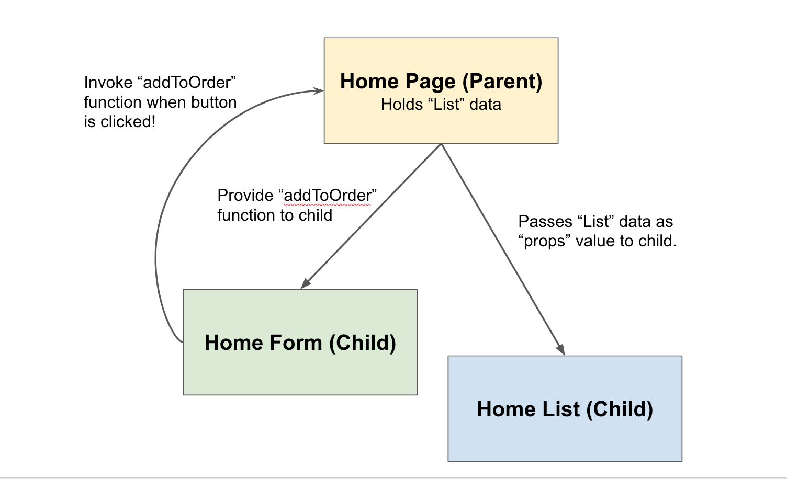
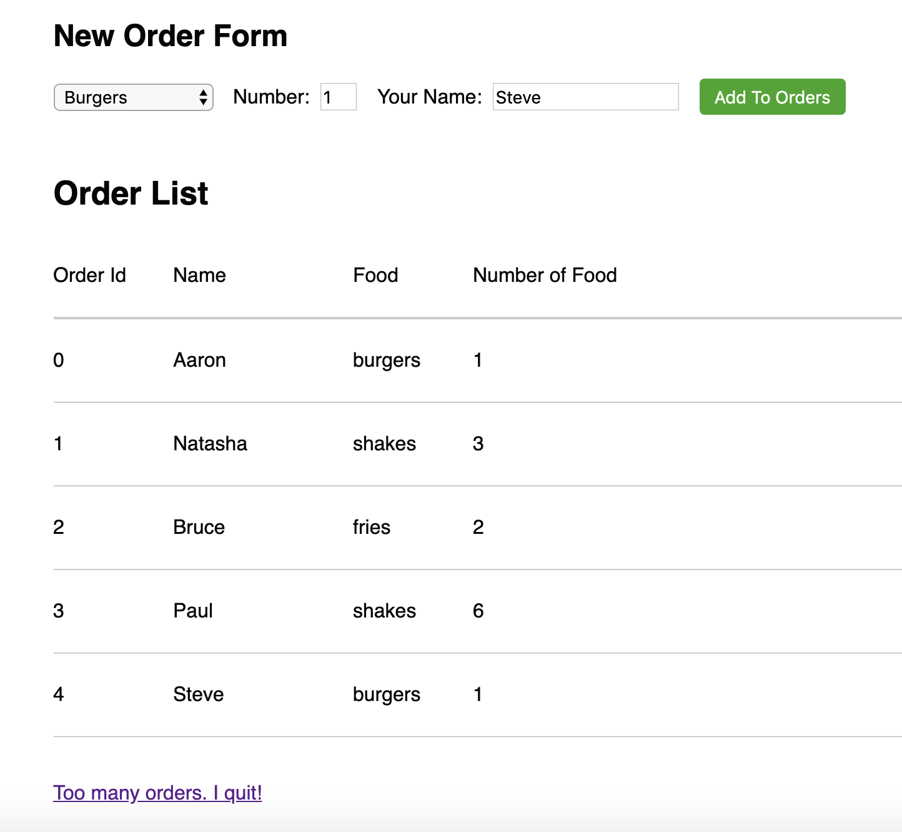

# Passing Functions in React

At this point, we've done the following in our ShakeShack app:

- We have a HomePage which is our most parent component
- We have a child component HomeOrderForm which adds orders to the list
- We have a child component HomeOrderList which displays the list

However, at the moment, HomeOrderForm isn't really adding to our list of orders. And HomeOrderList is still displaying a fake list. We're going to connect them together using **functions as parameters**.

## The Gist

So we have this problem. We have two components that are modifying the same data. The HomeOrderForm is adding orders while the HomeOrderList is retrieving data in the list and also deleting orders too. So the question becomes who gets to internally save the orderList?

In React, the best way to solve this is to give it to their common ancestor, which is the parent `HomePage` component. The parent component will keep track of the list and provide ways for children components to modify data or retrieve data from the list.

- For HomeOrderList to retrieve list data from HomePage, the parent component can simply pass the list as a `props` value to the child component.
- For HomeOrderForm to *modify* the list data in HomePage, the parent component must provide an `addOrderToList(...)` function to the child component (also as a `props` value).



## Setting Up HomePage

To set up the HomePage component, we need to first define the list data as a state variable `orderList`. Add the following state in `HomePage`.

```javascript
state = {
    orderList: []
}
```

## Passing List to HomeOrderList

This one is easy. We need to pass `orderList` to the `HomeOrderList` child component so that `HomeOrderList` has access to this data.

```javascript
<HomeOrderList list={this.state.orderList}/>
```

***NOTES: props vs. state review***

- Remember that `orderList` is a state variable, so it can only be accessed with `this.state.___`.
- Inside `HomeOrderList`, we can access this data using `this.props.list`.
  - The reason why `HomeOrderList` uses `props` is because the data `list` is coming from an external source (`HomePage`).

## Passing Function to HomeOrderForm

First, let's define the function we need to pass. In `HomePage`, define `addOrderToList(...)`. This function takes in an order object and appends it to the state variable `orderList`.

```javascript
addOrderToList = (order) => {
    // to be implemented
}
```

***NOTES:***

- Remember that in order to modify a state variable, use `this.setState(...)`. Refer to a previous chapter for more details.
- Use `___.push(...)` to append an element to a Javascript list (<https://www.w3schools.com/jsref/jsref_push.asp>).

To pass this function to another Component, you can simply pass in the function name (but without the parantheses).

```javascript
<HomeOrderForm addOrderCallback={this.addOrderToList}/>
```

***NOTES:***

- Remember that the function `addOrderToList` can only be called with `this` before it.
- To access this function inside `HomeOrderForm`, it is available through `this.props.addOrderCallback`. Be sure to invoke this function when the form button is clicked.

### Are we on the same page?

To clarify, your HomePage code should look something like this:

```javascript
export default class HomePage extends React.Component {
    state = {
        orderList: []
    }

    addOrderToList = () => {
        ...
    }

    render() {
        return (
            ...
        );
    }
}
```

## Exercise

Now that `HomePage` is set up, we can modify `HomeOrderForm` and `HomeOrderList` to add a new order from the form to the list!

- In `HomeOrderForm.js`, modify onClickAddButton to create an order object and invoke the `addOrderToList` function you just passed in.
- In `HomeOrderList.js`, remove the fake list and use the list from `props` instead.

### Pause

If everything works, you should be able to keep adding orders and have the list show the different orders!



What's important to know here is that when the form button is clicked, the following happens:

- New order object is created and calls `this.props.addOrderToList(order)`. This function is passed in from `HomePage`.
- In `HomePage`, we execute `addOrderToList` which modifies the state variable `orderList`.
- Whenever a state variable is modified, we call `render()` which then passes the updated `orderList` to `HomeOrderList`.
- `HomeOrderList` now has the updated list in `this.props.list` and displays accordingly.


We'll do the "delete" parameter function in the next step. It has a very similar flow.

---

[Continue](./14_delete_parameter_function.md)